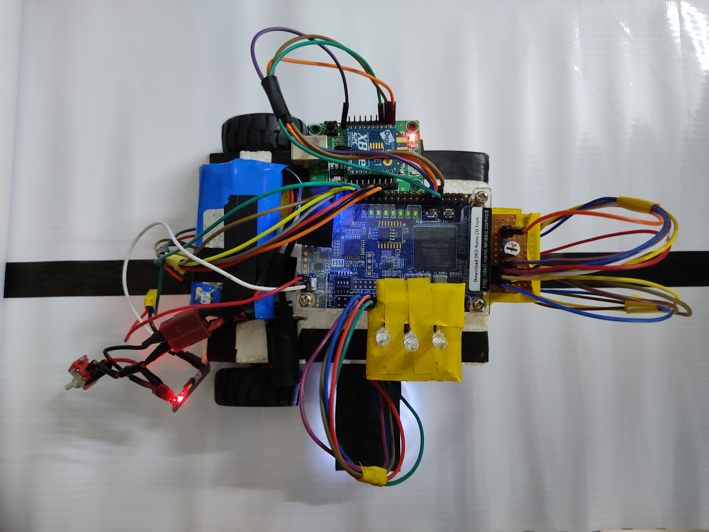
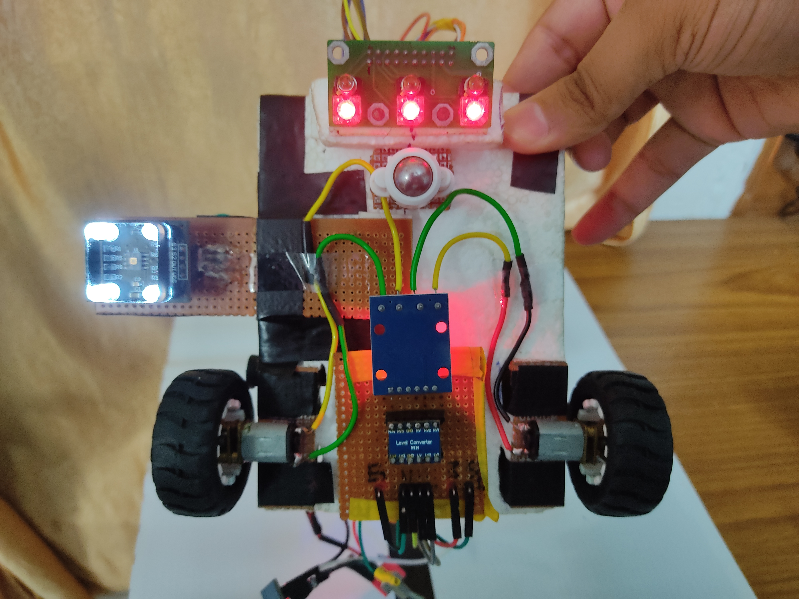

# FPGA BOT

FPGA based line follower bot using DE0-nano (Altera cyclone 4E FPGA) along with integration of various sensors and components like line follower, TCS-3200 color sensor, motor drivers, Xbee, etc. to traverse an arena and complete a set of specified tasks.

 
  

Note: Using the code from this project may not work in other projects as this project is developed with specification and constraints of this bot in mind.
